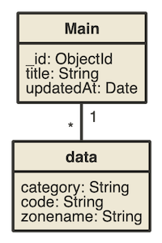

# Variety plugin - Nomnoml output

This plugin outputs results of Variety analysis in [Nomnoml](http://www.nomnoml.com/) (UML-like representation) format.

## Output

Given the following results:

+----------------------------------------------------------------------------+
| key                         | types    | occurrences | percents            |
| --------------------------- | -------- | ----------- | ------------------- |
| _id                         | ObjectId |          14 | 100.000000000000000 |
| title                       | String   |          14 | 100.000000000000000 |
| data                        | Array    |          13 |  92.857142857142861 |
| updatedAt                   | Date     |           6 |  42.857142857142854 |
| data.XX.code                | String   |           3 |  21.428571428571427 |
| data.XX.category            | String   |           2 |  14.285714285714286 |
| data.XX.zonename            | String   |           1 |   7.142857142857143 |
+----------------------------------------------------------------------------+

The output will be:

```
[Main|_id: ObjectId;title: String;updatedAt: Date] 
[data|category: String;code: String;zonename: String]
[Main]1-*[data]
```

which will give the following [representation in Nomnoml|http://www.nomnoml.com/#view/%5BMain%7C_id%3A%20ObjectId%3Btitle%3A%20String%3BupdatedAt%3A%20Date%5D%20%0A%5Bdata%7Ccategory%3A%20String%3Bcode%3A%20String%3Bzonename%3A%20String%5D%0A%5BMain%5D1-*%5Bdata%5D]:



## How to run plugin
First download the index.js file from this Github repository.

```
wget https://raw.githubusercontent.com/tvillaren/variety-plugin-nomnoml/master/index.js
```

Then pass the plugin path in Variety parameters like this:

```
mongo test --eval "var collection = 'users'; var plugins='/path/to/plugin/index.js';" variety.js
```

If you downloaded the plugin inside the same directory, where the is located also ```variety.js```,
you can omit the path and call Variety like this:

```
mongo test --eval "var collection = 'users'; var plugins='index.js';" variety.js
```

## Plugin options

Note than the current version of variety plugin doesn't allow use of more than 2 options.

### displayStats

By default, the output will not display the percentages or occurence counts for the field & related objects to avoid cluttering. You can add them by setting the `displayStats` parameter to true.

```
mongo test --eval "var collection = 'users'; var plugins='index.js|displayStats=true';" variety.js
```

The output will be 

```
[Main|_id: ObjectId (100%);title: String (100%);updatedAt: Date (42.86%)] 
[data|92.86%|category: String (14.29%);code: String (7.14%);zonename: String (7.14%)] 
[Main]1-*[data]
```

With the following Nomnoml representation:


### collectionName

Current version of the variety results doesn't contain the name of the original collection.  
In order to generate a complete graph of the collection, we need to specify the "main collection" name as a parameter:

```
mongo test --eval "var collection = 'users'; var plugins='index.js|displayStats=true|collectionName=users';" variety.js
```

If you can use only one option, this second one can always be added "manually" after the generation of the output, by replacing the `"No name"` string in the result with the name of your root collection.

## Hacking

This plugin is a fork from the CSV plugin found at https://github.com/todvora/variety-plugin-csv/
If you want to hack on this plugin, just fork this repository and change index.js content.

Please see also the test suite. You can run the tests from your browser or console (with node.js). The tests are writen in [Jasmine framework](https://jasmine.github.io/1.3/introduction.html).

### Console runner
You have to install node / npm first. Then you should install the test dependencies:

```
npm install -g jasmine-node jshint
```

Now you can run the test suite by calling
```
npm test
```

### Browser tests
If you don't want or can't run console tests, you can use the included HTML test runner. Open in your browser ```tests.html``` located inside this repository. You should see the current results of tests. To repeat execution  just reload the page.
